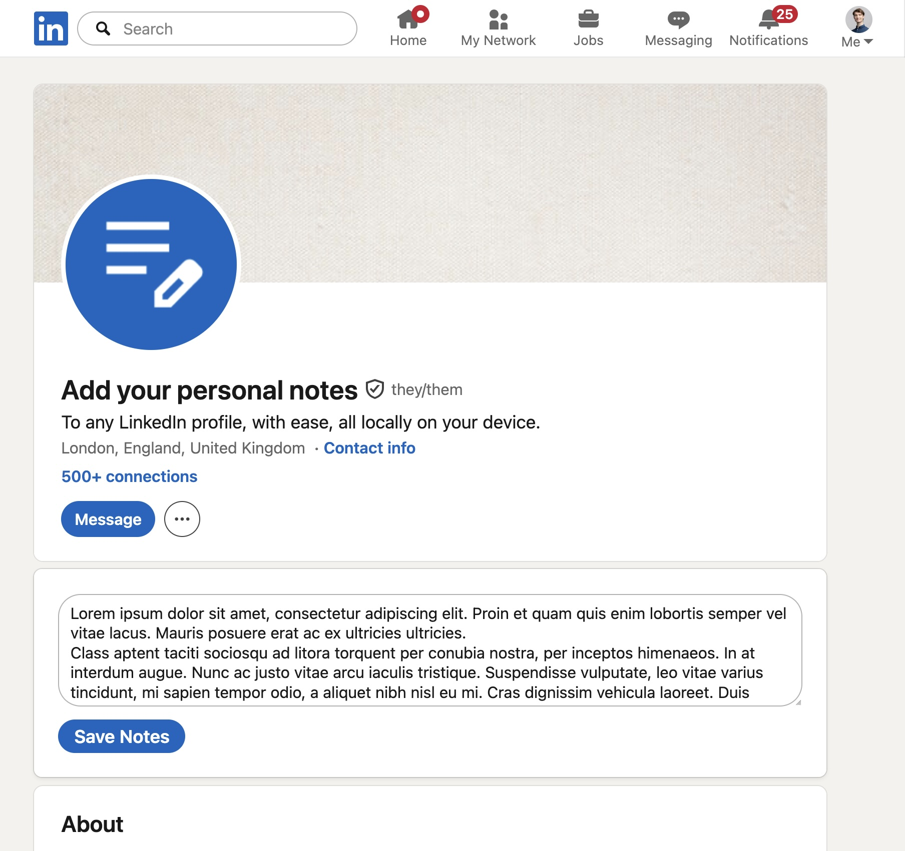

# Personal Notes for LinkedIn

A simple browser extension that lets you write private notes on any LinkedIn profile — stored locally in your browser, never sent anywhere.

---

> **Note:** Notes are stored in plain text and are **not encrypted**. Anyone with access to your browser profile or sync data can read them.
>
> This is an independent project and is not affiliated with, endorsed by, or sponsored by LinkedIn.

## Features

### Inline notes

A notes textarea appears directly on every LinkedIn profile page (`linkedin.com/in/…`). Type your note and click **Save Notes**. The note reappears whenever you visit that profile again.

### Notes viewer

Click the extension icon in your browser toolbar to open a full-page notes viewer. From there you can:

- **Browse** all saved notes in a searchable, sortable table (name, username, note content)
- **Search** across name, username, and note text
- **Sort** by any column
- **Open** a profile directly from the table
- **Copy** a note to the clipboard
- **Delete** individual notes
- **Export** all notes to a JSON file (for backup)
- **Import** notes from a previously exported JSON file (merges with existing notes, overwrites duplicates)
- **Choose where notes are stored** — switch between **sync storage** (syncs across your devices, limited size) and **local storage** (holds far more notes, but stays on this device only)
- **File sync** _(Chrome / Edge only)_ — link a local JSON file that updates automatically every time a note changes, so you always have an up-to-date plain-text backup on disk

### Cross-browser

Works on Chrome, Edge, and Firefox.

## Privacy

All notes are stored using the browser's built-in storage APIs — either `storage.sync` (the default; if you are signed in to browser sync, notes are synced across your own devices) or `storage.local` (kept on this device only). You choose which in the notes viewer. In both cases notes are **never sent to any external server**. Sync, when enabled, goes through your browser's own account.

Notes are stored in **plain text and are not encrypted**. Treat them like any other local browser data.

The extension only runs on `*.linkedin.com` pages. You must grant the extension access to the LinkedIn domain when prompted by your browser.

**Verifying this yourself:** The extension has no network permissions in `manifest.json` — it only declares the `storage` permission. The two relevant source files are `content.js` (runs on LinkedIn pages, reads/writes notes) and `src/background.js` (opens the notes viewer tab when you click the icon). There is no analytics, telemetry, or external requests of any kind.

## Storage limits

Notes are kept in one of two places, switchable in the notes viewer:

- **Sync storage** _(default)_ — syncs across your devices, but is limited to roughly **100 KB total / 512 notes**, with each note capped at about **8 KB**. The extension warns you if a note exceeds the per-note limit, and if sync storage fills up it suggests switching to local storage.
- **Local storage** — holds far more notes and removes the per-note size limit, but the notes stay on **this device only** (they don't sync).

Switching to local storage **copies** your notes across without touching the sync copy, so your other devices keep theirs. You can switch back to sync storage only if your notes still fit within the sync limits.

Exported and synced backup files are JSON and are also plain text. Store them somewhere you trust.

## Installation

### Chrome / Edge (from the Chrome Web Store)

### Firefox (from Firefox Add-ons)

### Manual install (developer mode)

**Chrome / Edge:**

1. [Download the latest zip](../../releases/latest) and unzip it, or clone this repository
2. Go to `chrome://extensions` and enable **Developer mode**
3. Click **Load unpacked** and select the unzipped folder
4. When prompted, allow the extension to access `linkedin.com`

**Firefox:**

1. [Download the latest Firefox zip](../../releases/latest) and unzip it, or clone this repository
2. Go to `about:debugging#/runtime/this-firefox`
3. Click **Load Temporary Add-on** and select `manifest.json` inside the folder
4. When prompted, allow the extension to access `linkedin.com`

> Firefox temporary add-ons are removed when the browser restarts. For a persistent install in standard Firefox, install the signed version from Firefox Add-ons once published.

## Contributing

The extension has no build step — it's plain JS, HTML, and CSS, loadable directly as an unpacked extension.

**Key files:**

| File                             | Role                                                                                             |
| -------------------------------- | ------------------------------------------------------------------------------------------------ |
| `content.js`                     | Injected into LinkedIn pages — detects profile pages, injects the notes UI, reads/writes storage |
| `src/background.js`              | Service worker — opens the notes viewer tab when the toolbar icon is clicked                     |
| `pages/notes-viewer.html/js/css` | Full-page notes viewer (search, sort, export, import, file sync, sync/local storage toggle)      |
| `content.css`                    | Styles for the injected notes UI                                                                 |
| `manifest.json`                  | MV3 manifest (Chrome/Edge primary; Firefox via `browser_specific_settings`)                      |

**Cross-browser API:** All storage and browser calls use `const browserAPI = typeof browser !== 'undefined' ? browser : chrome` (defined in `src/shared.js`). Never use `chrome.*` directly.

**Storage:** notes live in either `browser.storage.sync` (default) or `browser.storage.local`, depending on the active mode (recorded under the `__storageMode` key in `storage.local`). Reads and writes go through the `getAllNotes` / `setNotes` / `removeNotes` helpers in `src/shared.js` so call sites don't care which area is active. Each entry is keyed by the LinkedIn member ID extracted from the page and stores `{ notes, username, memberId, name, createdAt, updatedAt }`, where the timestamps are ISO 8601 strings.

**Loading for development:**

- Chrome/Edge: `chrome://extensions` → Developer mode → Load unpacked
- Firefox: `about:debugging` → Load Temporary Add-on → select `manifest.json`
- Or use `npx web-ext run` for Firefox with auto-reload
